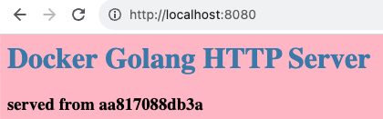
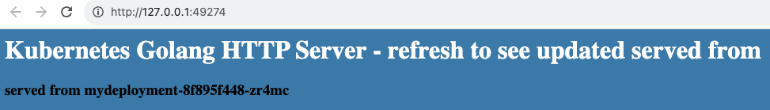
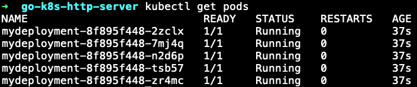

# Prerequisites

Install minikube and kubectl.

# Note

Building and running the docker image locally instead of pushing to docker hub.

# Run in Docker

`docker build -t philyawj/go-k8s-http-server .`

`docker run --rm -p 8080:8080 philyawj/go-k8s-http-server`

http://localhost:8080

# Run in Kubernetes

`docker build -t philyawj/go-k8s-http-server .`

`minikube image load philyawj/go-k8s-http-server`

`minikube image ls`

`kubectl apply -f service.yaml`

`minikube service mywebapp`

